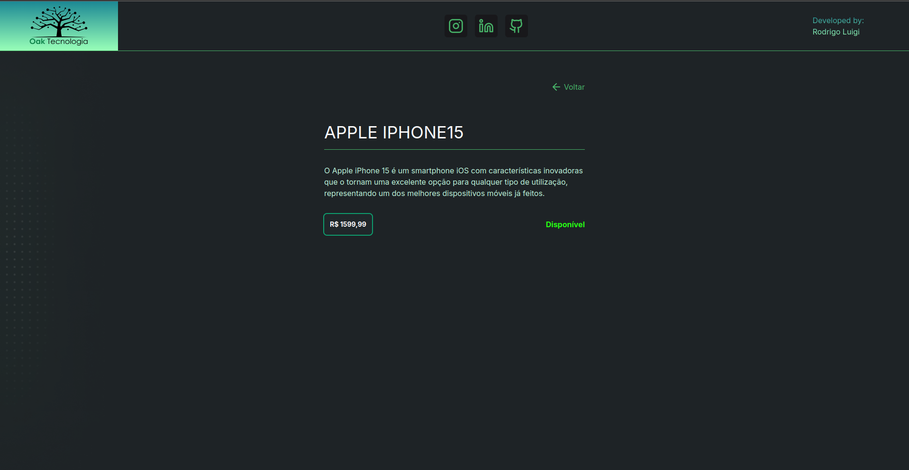

# <h1 id="top" align="center">Oak**Tecnologia**</h1>

<p align="center">
  <a href="#sobre">Sobre</a> &#xa0; | &#xa0; 
  <a href="#gear-features">Features</a> &#xa0; | &#xa0;
  <a href="#books-bibliotecas">Tecnologias</a> &#xa0; | &#xa0;
  <a href="#-requisitos">Requisitos</a> &#xa0; | &#xa0;
  <a href="#checkered_flag-iniciando">Iniciando</a> &#xa0; | &#xa0;
  <a href="https://github.com/RodrigoLuigi" target="_blank">Author</a>
</p>

<br>

## Screenshots

<div align="center">
  
  
  
  
  
  
</div>

<br><hr>

##  _**O que desenvolvemos neste Projeto?**_

📌 Neste projeto, desenvolvemos uma aplicação web completa para gerenciar produtos. O sistema permite o cadastro, listagem, e detalhamento de produtos, além de funcionalidades de pesquisa e filtragem. Com uma interface moderna e responsiva, construída com React e Tailwind CSS, e um backend robusto em Node.js.

## :gear: Features

:heavy_check_mark: Cadastro de Produto\
:heavy_check_mark: Listar Produtos\
:heavy_check_mark: Detalhes do Produto\
:heavy_check_mark: Pesquisar produtos pelo nome\
:heavy_check_mark: Filtrar produtos por preço

## :books: Bibliotecas

_**As seguintes bibliotecas e frameworks foram utilizadas neste projeto:**_

**Frond-end**

- [Vite](https://vitejs.dev/)
- [ReactJs](https://react.dev/)
- [Tailwind CSS](https://tailwindcss.com/)
- [Axios](https://axios-http.com/)
- [Lucide Icons](https://lucide.dev/)
- [Tailwind Scrollbar](https://www.npmjs.com/package/tailwind-scrollbar)
- [Flowbite](https://flowbite.com/)
- [react-number-format](https://www.npmjs.com/package/react-number-format)
- [react-toastify](https://fkhadra.github.io/react-toastify/)

**Back-end**

- [NodeJs](https://nodejs.org/)
- [Express](https://expressjs.com/)
- [express-async-errors](https://www.npmjs.com/package/express-async-errors)
- [TypeScript](https://www.typescriptlang.org/)
- [Cors](https://www.npmjs.com/package/cors)
- [SQLite](https://www.sqlite.org/index.html)
- [Knex](https://knexjs.org/)

## 📝 Requisitos

- [Git](https://git-scm.com)
- [Node](https://nodejs.org/en/)
- [npm](https://www.npmjs.com/)

## :checkered_flag: Iniciando

#### Inicializando aplicação Back-end

```bash

**Passo 1**

# Clone este projeto
$ git clone https://github.com/RodrigoLuigi/oak-tecnologia.git

# Acesse o projeto
$ cd oak-tecnologia/api

# Instale as dependências
$ npm install

# Inicializando projeto
$ npm start

# Inicializando projeto modo Desenvolvimento
$ npm run dev

# O Server irá inicializar em http://localhost:3333
```

```bash
# [POST] Criar produto
/products

# [GET] Listar produtos
/products

# [GET] Listar produtos com pesquisa
/products?name={searchTerm}

# [GET] Listar produto por id
/products/:id
```

#### Inicializando aplicação Front-end

```bash

**Passo 2**

# Acesse o projeto
$ cd oak-tecnologia/web

# Instale as dependências
$ npm install

# Execute o projeto com npm
$ npm run dev

# O Server irá inicializar em http://localhost:5173
```

&#xa0;

_**Feito por <a href="https://github.com/RodrigoLuigi" target="_blank">Rodrigo Luigi</a>**_ 👨‍🚀

<a href="#top">Back to top</a>
